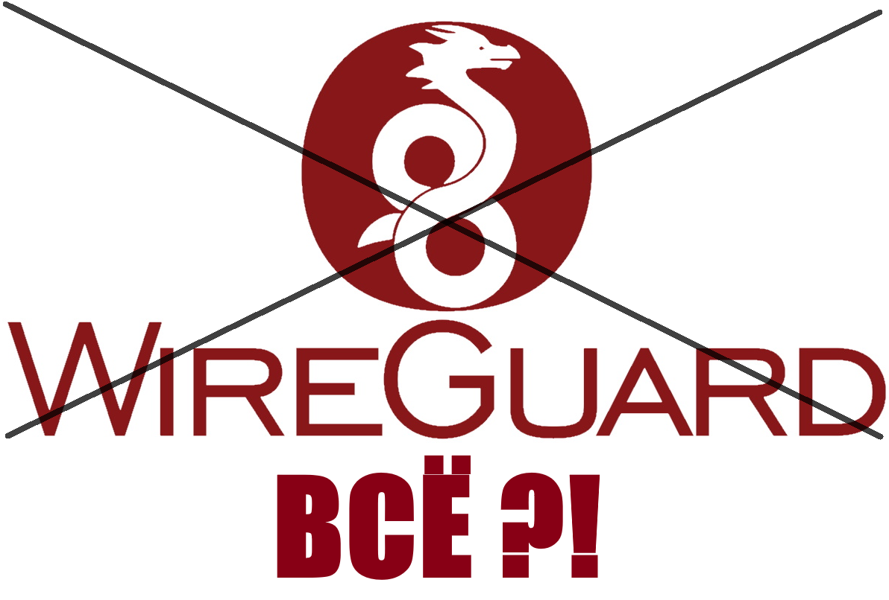

# WireGuard в России: Конец эпохи

**WireGuard мёртв в России. Всё. Починить его не получится.** Роскомнадзор (РКН) заблокировал протокол WireGuard, и это не временная проблема. Блокировки становятся всё более изощрёнными, и попытки обойти их — пустая трата времени. Если вы всё ещё пытаетесь заставить WireGuard работать, прекратите. Это бесполезно.

---

## Что делать?

**Переходите на Vless.** Это единственное надёжное решение на данный момент. Vless — протокол, который пока не подвергается таким жёстким блокировкам, и он продолжает работать стабильно.

**Инструкции по настройке Vless:**

- [Развёртывание прокси-протокола Vless с помощью 3X-UI](https://wiki.yukikras.net/ru/razvertyvanie-proksi-protokola-vless-s-pomoshyu-3x-ui)
- [Развёртывание прокси-протокола Vless с помощью Marzban](https://wiki.yukikras.net/ru/razvertyvanie-proksi-protokola-vless-s-pomoshyu-marzban)
- [Настройка Vless клиентов для всех платформ](https://wiki.yukikras.net/ru/nastroikavpn)

Не откладывайте переход. WireGuard не вернётся.

---

## Как РКН блокирует WireGuard

РКН использует несколько методов для блокировки WireGuard, и они работают в комплексе:

1. **DPI (Deep Packet Inspection):** РКН применяет глубокую проверку пакетов, анализируя трафик на наличие сигнатур WireGuard. Протокол имеет характерные особенности в структуре пакетов, которые легко обнаруживаются современными системами фильтрации.
2. **Блокировка портов:** Стандартные порты WireGuard, такие как 51820/UDP, блокируются на уровне провайдеров. Даже если вы смените порт, это не спасёт — DPI всё равно распознает трафик.
3. **Блокировка IP-адресов:** Если сервер с WireGuard попадает в поле зрения РКН, его IP может быть внесён в чёрный список. Это делает весь сервер недоступным для пользователей в России.

Эти методы постоянно обновляются и расширяются. РКН не просто "ломает" WireGuard — они систематически уничтожают его как рабочий инструмент в РФ.

---

## Если WireGuard ещё работает у вас

Если у вас WireGuard всё ещё работает, это **специфика вашего провайдера или региона**. Возможно, ваш провайдер ещё не внедрил все меры блокировки, или ваш сервер пока не попал под раздачу. Но не обольщайтесь: это ненадолго. С каждым днём жалоб на неработающий WireGuard становится всё больше. Пользователи по всей стране сообщают, что соединение либо не устанавливается, либо обрывается через пару минут. Это не случайность, это тенденция. Скоро он перестанет работать и у вас.

Не ждите, пока вас накроет. Переходите на Vless сейчас.

---

## FAQ: Ответы на вопросы

### **"У моего друга работает!"**

Ну и что? У твоего друга, может, провайдер ещё не включил полные блокировки, или он сидит в какой-то глуши, где РКН ещё не добрался. Это **временное везение**. Скоро и у него всё накроется, как у всех. Не сиди и не жди, пока твой друг тоже начнёт ругаться, что "WireGuard сломался". Переходи на Vless.

### **"На другом сервере работает!"**

Поздравляю, ты нашёл сервер, который пока не заблокировали. Но это не значит, что WireGuard "жив". Разные серверы — разные конфигурации, разные хостеры, разные регионы. РКН может накрыть твой "рабочий" сервер в любой момент, и ты останешься с носом. Хватит играть в рулетку — переходи на Vless.

### **"Я слышал, что он работает!"**

Может, кто-то где-то запустил WireGuard на пять минут и решил, что всё ок. Реальность: WireGuard в России блокируется повсеместно. Каждый день новые пользователи пишут, что он не работает. Хватит верить в сказки — переходи на Vless.

### **"Может, есть способ обойти блокировку?"**

Нет. Все "обходы" — смена портов, маскировка трафика — либо не работают, либо работают пару дней, пока РКН не подтянет свои фильтры. Это не игра в кошки-мышки, где ты можешь победить. РКН выигрывает, и точка. Перестань тратить время и переходи на Vless.

### **"А если я сменю порт или провайдера?"**

Смена порта — бесполезно, DPI видит сигнатуры WireGuard независимо от порта. Смена провайдера? Может, и сработает на неделю, если повезёт найти какого-то мелкого оператора, который ещё не под РКН. Но это не решение, а оттягивание неизбежного. WireGuard всё равно накроется. Переходи на Vless.

---

**ЧТО ДЕЛАТЬ?** [Переходите на Vless](https://wiki.yukikras.net/ru/razvertyvanie-proksi-protokola-vless-s-pomoshyu-3x-ui) прямо сейчас.
